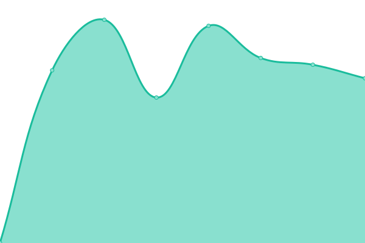
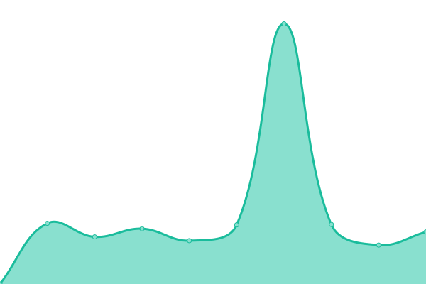
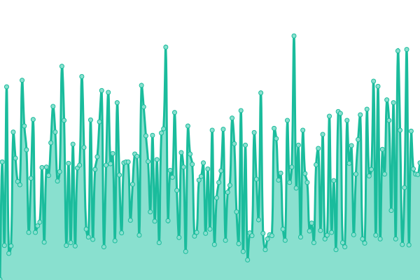

# [📈 Live Status](https://up.wbu.world): <!--live status--> **🟩 All systems operational**

<!--start: status pages-->
<!-- This summary is generated by Upptime (https://github.com/upptime/upptime) -->
<!-- Do not edit this manually, your changes will be overwritten -->
<!-- prettier-ignore -->
| URL | Status | History | Response Time | Uptime |
| --- | ------ | ------- | ------------- | ------ |
|  Gateway (Leased line) | 🟩 Up | [gateway-leased-line.yml](https://github.com/kizzna/uptime/commits/HEAD/history/gateway-leased-line.yml) | 

 872ms
     
 | 

<a href="https://up.wbu.world/history/gateway-leased-line">83.51%</a>
    

|  [Gateway (3bb)](https://check-3bb.gongtham.net/index.php) | 🟩 Up | [gateway-3bb.yml](https://github.com/kizzna/uptime/commits/HEAD/history/gateway-3bb.yml) | 

 1251ms
     
 | 

<a href="https://up.wbu.world/history/gateway-3bb">100.00%</a>
    

|  [Gateway (True)](https://check-true.gongtham.net/index.php) | 🟩 Up | [gateway-true.yml](https://github.com/kizzna/uptime/commits/HEAD/history/gateway-true.yml) | 

 1211ms
     
 | 

<a href="https://up.wbu.world/history/gateway-true">100.00%</a>
    

|  [Gongtham.net](http://gongtham.net) | 🟩 Up | [gongtham-net.yml](https://github.com/kizzna/uptime/commits/HEAD/history/gongtham-net.yml) | 

 634ms
     
 | 

<a href="https://up.wbu.world/history/gongtham-net">100.00%</a>
    

|  [Dhammastudy.org](https://dhammastudy.org) | 🟩 Up | [dhammastudy-org.yml](https://github.com/kizzna/uptime/commits/HEAD/history/dhammastudy-org.yml) | 

 1236ms
     
 | 

<a href="https://up.wbu.world/history/dhammastudy-org">100.00%</a>
    

|  [Dhammastudy.net](https://dhammastudy.net) | 🟩 Up | [dhammastudy-net.yml](https://github.com/kizzna/uptime/commits/HEAD/history/dhammastudy-net.yml) | 

 1185ms
     
 | 

<a href="https://up.wbu.world/history/dhammastudy-net">84.07%</a>
    

|  [Exam1](https://exam1.gongtham.net/__test.php) | 🟩 Up | [exam1.yml](https://github.com/kizzna/uptime/commits/HEAD/history/exam1.yml) | 

 1156ms
     
 | 

<a href="https://up.wbu.world/history/exam1">54.10%</a>
    

|  [Exam2](https://exam2.gongtham.net/__test.php) | 🟩 Up | [exam2.yml](https://github.com/kizzna/uptime/commits/HEAD/history/exam2.yml) | 

 1242ms
     
 | 

<a href="https://up.wbu.world/history/exam2">100.00%</a>
    

|  [Exam3](https://exam3.gongtham.net/__test.php) | 🟩 Up | [exam3.yml](https://github.com/kizzna/uptime/commits/HEAD/history/exam3.yml) | 

 1006ms
     
 | 

<a href="https://up.wbu.world/history/exam3">83.51%</a>
    

|  [Onab](https://onab.gongtham.net) | 🟩 Up | [onab.yml](https://github.com/kizzna/uptime/commits/HEAD/history/onab.yml) | 

 900ms
     
 | 

<a href="https://up.wbu.world/history/onab">100.00%</a>
    

|  [Sangharaja](https://sangharaja.org) | 🟩 Up | [sangharaja.yml](https://github.com/kizzna/uptime/commits/HEAD/history/sangharaja.yml) | 

 2522ms
     
 | 

<a href="https://up.wbu.world/history/sangharaja">84.45%</a>
    

|  [WBU](https://wbu.world) | 🟩 Up | [wbu.yml](https://github.com/kizzna/uptime/commits/HEAD/history/wbu.yml) | 

 1946ms
     
 | 

<a href="https://up.wbu.world/history/wbu">84.45%</a>
    

|  [Mahasamana](https://mahasamana.org) | 🟩 Up | [mahasamana.yml](https://github.com/kizzna/uptime/commits/HEAD/history/mahasamana.yml) | 

 2320ms
     
 | 

<a href="https://up.wbu.world/history/mahasamana">84.44%</a>
    

|  [Watbovorn](https://watbovorn.org) | 🟩 Up | [watbovorn.yml](https://github.com/kizzna/uptime/commits/HEAD/history/watbovorn.yml) | 

 1400ms
     
 | 

<a href="https://up.wbu.world/history/watbovorn">84.44%</a>
    

|  [Dhammayut](https://dhammayut.org) | 🟩 Up | [dhammayut.yml](https://github.com/kizzna/uptime/commits/HEAD/history/dhammayut.yml) | 

 1878ms
     
 | 

<a href="https://up.wbu.world/history/dhammayut">84.44%</a>
    

|  [Thainess](https://thainess.net) | 🟩 Up | [thainess.yml](https://github.com/kizzna/uptime/commits/HEAD/history/thainess.yml) | 

 2356ms
     
 | 

<a href="https://up.wbu.world/history/thainess">84.44%</a>
    

<!--end: status pages-->
